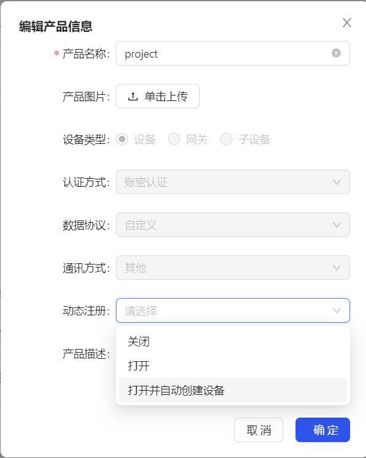

# 设备动态注册

## 简介
用户可以通过设备向云平台发送注册请求实现在云平台上注册设备。

## 应用场景
- 对于一机一密的场景，需要在生产环节将为每一个设备烧录由平台生成的唯一设备信息。
- 对于一型一密场景，同一产品类型的设备只要预置产品级密钥，可省去工厂的设备信息烧录。设备出厂后，在第一次开机且成功联网的情况下，
  可发起动态注册，通过产品密钥鉴权，从平台获取设备信息，然后存在本地，达成和工厂烧录一样的效果。

## 使用步骤
1. 在控制台使能产品的动态注册功能。
>!  使能动态注册后才有产品密钥。

- 这里预留展示产品密钥图片
2. 选择是否使能自动设备创建。这个选项决定动态注册的时候的设备名，是设备自定义的(需要保证统一产品下设备名唯一)，还是使用平台预定义的设备名
3. 调用设备动态注册接口进程设备注册。

## 参数说明
设备动态注册时需携带 ProductID、ProductSecret 和 DeviceName 向平台发起 http/https 请求，请求接口及参数如下：

请求的 URL 为：
- https://{route}/register
- http://{route}/register

请求方式：Post。

## 请求参数

| 参数名称        | 类型      | 必须  | 说明        |
|-------------|---------|-----|-----------|
| productId   | string  | 是   | 产品 ID     |
| deviceName  | string  | 是   | 设备名称      |
| nonce       | int64   | 是   | 随机数       |
| timestamp   | int64   | 是   | 秒级时间戳     |
| signature   | string  | 是   | 签名信息      |

### 签名生成步骤:
1. 对参数（deviceName、nonce、productId、timestamp）按字典序升序排序。
2. 将以上参数，按参数名称 = 参数值 & 参数名称 = 参数值拼接成字符串, 如："deviceName=xxx&nonce=2125656451&productId=xxx&timestamp=1687525491"。
3. 使用 HMAC-sha1 算法对上一步中获得的字符串进行计算，密钥为 ProductSecret。
4. 将生成的结果使用 Base64 进行编码，即可获得最终的签名串放入 signature。

## 平台返回参数

| 参数名称      | 类型         | 描述                |
|-----------|------------|-------------------|
| code      | string     | 错误码               |
| msg       | string     | 错误信息              |
| data      | object     |                   |
| - len     | int64      | 长度                |
| - payload | string     | 设备连接信息的 AES 加密后内容 |

说明：
加密过程将原始 JSON 格式的 payload 转为字符串后进行 AES 加密，再进行 base64 加密。AES 加密算法为 CBC 模式，密钥长度128，取 productSecret 前16位，偏移量为长度16的字符“0”。

原始 payload 内容说明：

| key            | value      | 描述                                     |
|----------------|------------|----------------------------------------|
| encryptionType | 1          | 加密类型，1表示证书认证，2表示签名认证                   |
| psk            | 1239465801 | 设备密钥，当产品认证类型为签名认证时有此参数                 |
| clientCert     | -          | 设备证书文件字符串格式，当产品认证类型为证书认证时有此参数          |
| clientKey      | -          | 设备私钥文件字符串格式，当产品认证类型为证书认证时有此参数          |
